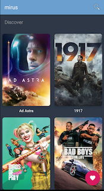

# mirus 
---

A movie app 

  

**Libraries**

[Kotlin](https://kotlinlang.org/docs/reference/)

MDB](https://www.themoviedb.org/documentation/api)

oroutines](https://kotlinlang.org/docs/reference/coroutines.html)

[Retrofit](https://github.com/square/retrofit)

[Gson](https://github.com/google/gson)

[Picasso](https://square.github.io/picasso/)

**Android Architecture Component**

[Architecture](https://github.com/googlesamples/android-architecture-components)

[Lifecycle](https://developer.android.com/topic/libraries/architecture/lifecycle)

[View Model](https://developer.android.com/topic/libraries/architecture/viewmodel)

[Live data](https://developer.android.com/topic/libraries/architecture/livedata.html)

